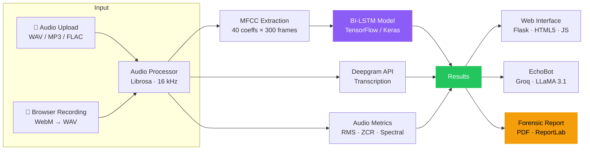
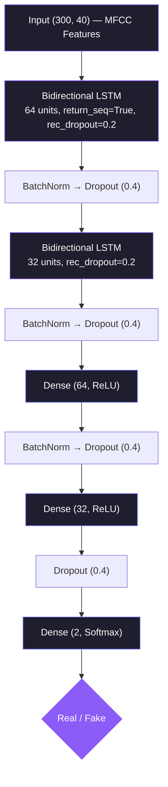
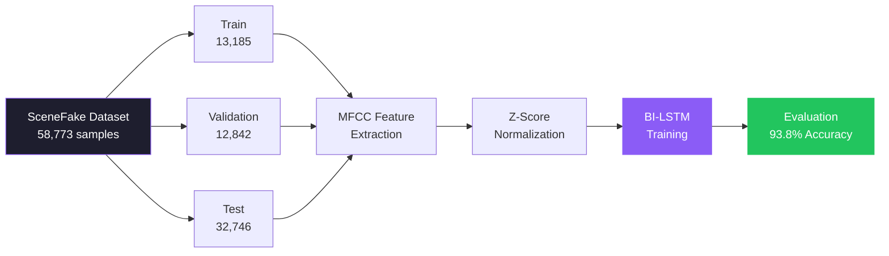
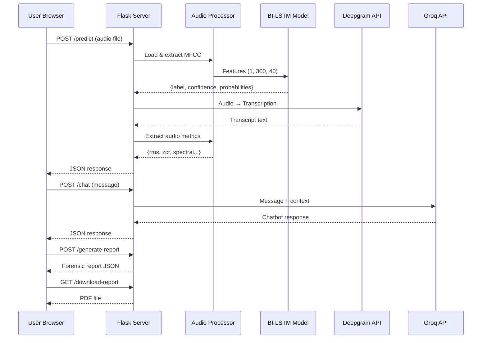

# 🛡️ EchoShield: AI-Powered Deepfake Audio Detection

EchoShield is a full-stack deepfake audio detection system built with Flask and a BI-LSTM (Bidirectional Long Short-Term Memory) neural network. Users can upload audio files or record directly in the browser, and the system classifies the audio as **Real** or **Fake** with confidence scores, speech transcription, forensic report generation, and an AI chatbot for result interpretation.

Trained on the **SceneFake dataset** (58,773 samples), the model achieves **93.8% accuracy**, **99.0% recall**, and a **96.3% F1-score**.

---

## System Architecture



## Features

| Feature | Description |
|---|---|
| **Audio Upload** | Drag-and-drop or browse for WAV, MP3, FLAC files (up to 50 MB) |
| **Live Recording** | Record audio in-browser with automatic WebM → WAV conversion |
| **BI-LSTM Detection** | Classifies audio as Real or Fake with confidence scores |
| **Audio Metrics** | Peak amplitude, RMS level, dynamic range, spectral centroid, ZCR, noise floor |
| **Waveform Visualization** | Real-time canvas-based waveform with playback controls |
| **Speech Transcription** | Multilingual speech-to-text via Deepgram Nova-2 API |
| **AI Chatbot (EchoBot)** | Context-aware assistant powered by Groq (LLaMA 3.1 8B) |
| **Forensic Reports** | Downloadable PDF reports with SHA-256 hash, metrics, indicators, and recommendations |
| **Responsive UI** | Dark-themed interface with animations, works on desktop and mobile |
| **Social Sharing** | Share detection results on Twitter, Facebook, LinkedIn, Instagram |

---

## Model Performance

| Metric | Score |
|---|---|
| Accuracy | 93.8% |
| Precision | 93.7% |
| Recall | 99.0% |
| F1-Score | 96.3% |
| AUC-ROC | 88.6% |
| Trainable Parameters | 102,306 |

Evaluated on **32,746 test samples** from the SceneFake dataset.

---

## Model Architecture



- **Input**: 40 MFCC coefficients × 300 time frames (16 kHz, z-score normalized)
- **Optimizer**: Adam (lr=0.0001, clipnorm=1.0)
- **Loss**: Sparse Categorical Cross-Entropy
- **Callbacks**: EarlyStopping (patience=10), ModelCheckpoint, ReduceLROnPlateau (factor=0.5, patience=5)

### Dataset — SceneFake



| Split | Real | Fake | Total |
|---|---|---|---|
| Training | 2,637 | 10,548 | 13,185 |
| Validation | 2,548 | 10,294 | 12,842 |
| Test | 6,334 | 26,412 | 32,746 |
| **Total** | **11,519** | **47,254** | **58,773** |

Audio files in WAV format with varying SNR levels (0, 5, 10, 15, 20 dB) and multiple acoustic conditions (A–D).

---

## Installation

### Prerequisites

- Python 3.8+
- pip
- Modern browser (Chrome, Firefox, Safari, Edge)

### Setup

```bash
# 1. Clone the repository
git clone https://github.com/itsBabuaa/EchoShield.git
cd EchoShield

# 2. Install dependencies
pip install -r requirements.txt

# 3. Create .env from template
cp .env.example .env
# Edit .env and add your API keys

# 4. Train the model (requires SceneFake dataset in ./scenefake/)
python train_model.py

# 5. Run the application
python app.py
```

Open `http://localhost:5000` in your browser.

### Environment Variables

Create a `.env` file (see `.env.example`):

| Variable | Default | Description |
|---|---|---|
| `MODEL_PATH` | `models/bilstm_model.keras` | Path to trained model file |
| `UPLOAD_FOLDER` | `uploads` | Temporary upload directory |
| `SAMPLE_RATE` | `16000` | Audio resampling rate (Hz) |
| `N_MFCC` | `40` | Number of MFCC coefficients |
| `MAX_AUDIO_LENGTH` | `300` | Max time frames for model input |
| `GROQ_API_KEY` | — | Groq API key for chatbot ([get one](https://console.groq.com/)) |
| `DEEPGRAM_API_KEY` | — | Deepgram API key for transcription ([get one](https://console.deepgram.com/)) |
| `SECRET_KEY` | `dev-secret-key` | Flask session secret |
| `FLASK_DEBUG` | `False` | Enable Flask debug mode |
| `TRAIN_PATH` | `./scenefake/train` | Training data path |
| `DEV_PATH` | `./scenefake/dev` | Validation data path |
| `TEST_PATH` | `./scenefake/test` | Test data path |

---

## Usage

### Upload Audio
1. Go to the **Detect** page
2. Drag-and-drop an audio file (WAV, MP3, FLAC) or click to browse
3. Click **Analyze Audio**
4. View results: confidence gauge, prediction badge, audio metrics, transcript

### Record Audio
1. Click the microphone button on the **Detect** page
2. Allow microphone access when prompted
3. Click the stop button when done — audio is automatically converted to WAV
4. Click **Analyze Audio**

### AI Chatbot (EchoBot)
After analysis, EchoBot appears with full context of your results. Ask it about:
- What the confidence score means
- Audio metric explanations (RMS, spectral centroid, etc.)
- How the BI-LSTM model works
- General deepfake detection concepts

### Forensic Report
After analysis, click **Generate Report** to create a detailed forensic report, then **Download PDF**. The report includes:
- Unique report ID and timestamp
- File SHA-256 hash for integrity verification
- Authenticity assessment with risk level
- Full technical audio metrics
- Detection indicators and recommendations

---

## Pages

| Route | Page | Description |
|---|---|---|
| `/` | Home | Hero section, problem overview, real-world impact stories, solution explanation |
| `/detect` | Detect | Audio upload/recording, analysis results, waveform player, chatbot, forensic reports |
| `/model-info` | Model Info | Architecture details, training config, performance metrics |
| `/learn-more` | Learn More | In-depth information about deepfake audio technology |
| `/about` | About Us | Team members with photos and contributions |

---

## API Endpoints



| Method | Route | Description |
|---|---|---|
| `GET` | `/` | Home page |
| `GET` | `/detect` | Detection interface |
| `GET` | `/model-info` | Model information page |
| `GET` | `/learn-more` | Deepfake education page |
| `GET` | `/about` | Team page |
| `POST` | `/predict` | Upload audio → returns prediction, transcript, audio metrics |
| `POST` | `/transcribe` | Upload audio → returns transcript only |
| `POST` | `/chat` | Send message → returns chatbot response |
| `POST` | `/chat/clear` | Clear chatbot conversation history |
| `POST` | `/generate-report` | Generate forensic report from last analysis |
| `GET` | `/download-report` | Download forensic report as PDF |

### Example: `/predict` Response

```json
{
  "success": true,
  "prediction": {
    "label": "fake",
    "confidence": 0.97,
    "probabilities": { "real": 0.03, "fake": 0.97 }
  },
  "transcript": "Hello, this is a test recording.",
  "audio_metrics": {
    "duration": 3.52,
    "sample_rate": 16000,
    "file_size": 112640,
    "peak_amplitude": 0.8234,
    "rms_level": -12.3,
    "dynamic_range": 6.1,
    "zero_crossings": 1842,
    "spectral_centroid": 2156,
    "noise_floor": -45.2
  }
}
```

---

## Project Structure

```
EchoShield/
├── app.py                  # Flask application — routes, error handlers, session management
├── audio_processor.py      # Audio loading, MFCC extraction, signal metrics
├── prediction_engine.py    # Model loading and inference
├── transcriber.py          # Deepgram API speech-to-text (multilingual, Nova-2)
├── chatbot.py              # Groq API chatbot with context-aware responses
├── forensic_report.py      # PDF forensic report generation (ReportLab)
├── train_model.py          # Full training pipeline — data loading, MFCC extraction, BI-LSTM training
├── config.py               # Centralized config from .env
├── requirements.txt        # Python dependencies
├── .env.example            # Environment variable template
├── research_paper.tex      # IEEE-format research paper (LaTeX)
│
├── models/
│   ├── bilstm_model.keras  # Trained model (Keras format)
│   └── bilstm_model.h5     # Trained model (H5 format)
│
├── templates/
│   ├── base.html           # Base layout — header, nav, footer
│   ├── home.html           # Landing page with problem/solution narrative
│   ├── detect.html         # Detection interface — upload, record, results, chatbot, reports
│   ├── model_info.html     # Model architecture and metrics display
│   ├── learn_more.html     # Educational content about deepfakes
│   ├── about.html          # Team page
│   └── index.html          # Fallback/404 page
│
├── static/
│   ├── css/style.css       # Full application styles (dark theme, responsive)
│   ├── js/main.js          # Frontend logic — upload, recording, playback, chatbot, reports
│   └── images/             # Team photos and assets
│
└── uploads/                # Temporary directory for uploaded files (auto-created)
```

---

## Technologies

| Layer | Technology |
|---|---|
| Backend | Flask, Python 3.8+ |
| Deep Learning | TensorFlow / Keras (BI-LSTM) |
| Audio Processing | Librosa, SoundFile, PyDub |
| Feature Extraction | MFCC (40 coefficients, 300 frames) |
| Transcription | Deepgram Nova-2 API (multilingual) |
| AI Chatbot | Groq API (LLaMA 3.1 8B Instant) |
| PDF Reports | ReportLab |
| Frontend | HTML5, CSS3, Vanilla JavaScript |
| Audio Recording | MediaRecorder API + Web Audio API (WebM → WAV) |
| Visualization | HTML5 Canvas (waveform) |
| HTTP Client | httpx (for Deepgram API calls) |

---

## Troubleshooting

| Problem | Solution |
|---|---|
| Model not found | Run `python train_model.py` or check `MODEL_PATH` in `.env` |
| Chatbot not responding | Set `GROQ_API_KEY` in `.env` — get one at [console.groq.com](https://console.groq.com/) |
| Transcription fails | Set `DEEPGRAM_API_KEY` in `.env` — get one at [console.deepgram.com](https://console.deepgram.com/) |
| Microphone blocked | Check browser permissions; use HTTPS in production |
| Upload fails | Max file size is 50 MB; supported formats: WAV, MP3, FLAC |
| Port conflict | Change the port in `app.py` or set `PORT` environment variable |

---

## Authors

- **Dr. Sonali Mathur** — Project Supervisor, Assistant Professor, Dept. of CSE, IMS Engineering College, Ghaziabad
- **Atharv Singh** — Lead Developer — Model training, Flask backend, API integration, chatbot system
- **Ayush Pratap Singh** — Back-End Developer — Flask architecture, API endpoints, audio processing pipeline
- **Ansh Srivastava** — Front-End Developer — UI/UX design, responsive layouts, interactive components
- **Anushka Singh** — Data Analyst — Dataset analysis, preprocessing, model validation

## Acknowledgments

- [SceneFake Dataset](https://zenodo.org/records/7663324) for training data
- [TensorFlow](https://www.tensorflow.org/) / [Keras](https://keras.io/) for the deep learning framework
- [Librosa](https://librosa.org/) for audio processing
- [Deepgram](https://deepgram.com/) for speech-to-text transcription
- [Groq](https://groq.com/) for AI chatbot capabilities
- [ReportLab](https://www.reportlab.com/) for PDF generation

---

## License

This project was developed as an academic project at IMS Engineering College, Ghaziabad.
